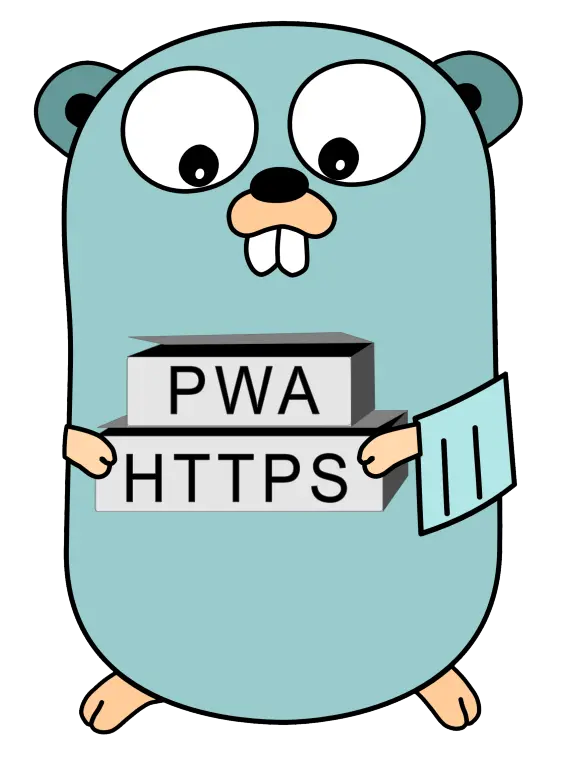

# Golang PWA prototype

 

Combining the most advanced `golang` techniques  
into a [Google Lighthouse](https://github.com/GoogleChrome/Lighthouse) approved web app

* HTTP/2

* Let's encrypt certification

* Localhost certificate based on [Filipo Valsordas tool](https://github.com/FiloSottile/mkcert)

* HTTP redirecting or co-existing

* Content Security Policies (`CSP`)  
  against CSRF

* Consistent versioning of HTML, JS, CSS, IMG,  
  _and_ service worker caching

* Adding a new version at any time by admin http request,  
  while older version files remain accessible

* Make changes to your app at any time,  
  without breaking service worker caching

* Server side gzip precompression of CSS and JS files;  
  integrated with version creation

* Fully developed PWA HTML template

* Fully developed PWA manifest

* PWA service worker with `cache-first` for static files

* Fallback to `/offline.html` for unprecedented user experience

  * PWA service worker register and install

  * PWA service worker pre-caching on install

  * PWA service worker fetch with `cache-first`
